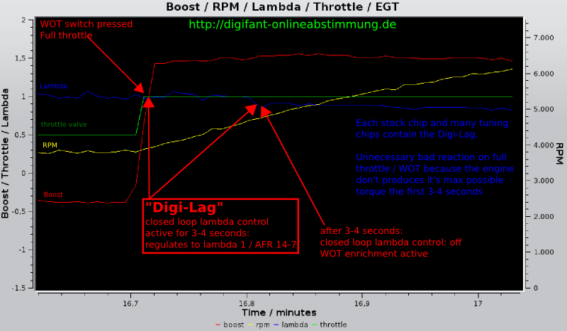

- **Digifant Hardware** - вся найденная документация и схемы на digifant
- **DigiInj** - все 4 версии программы Димы KDA
- **EEPROMs** - все найденные прошивки
- **Fuel Systems** - полезная документация об алгоритмах работы ЭБУ, рассчете времени впрыска
- **injectors** - динамическая производительность 905 и 431 форсунок. Инфа непроверенная, с картой из дигифанта не сильно коррелирует
- **convertParams.py** - Python-скрипт для преобразования hex-значений переменных в физические величины. Содержит формулы преобразования для всех датчиков, периода распредвала/коленвала и прочих данных, которыми оперирует ЭБУ

Тем, кто интересуется данной темой - открывайте vw6636 reversed/vw6636.idb в IDA Pro 6.1. Вся прошивка разобрана и максимально подробно прокомментирована на русском.
К примеру, задержка перед обогащением в режиме Full-Throttle (так называемый Digi-Lag), обусловлена константами по адресам 0x4433 и 0x4435. Обнулив их, получите обогащение мгновенно при замыкании микрика полной нагрузки.

**Отдельное спасибо plex и порталу corrado.su**