#Подключение блока к компу

####Вступление....
*Если кто-то захочет осуществить ниженаписанное, он делает это на свой страх и риск..... 
Программы, как для блока так и для компа находятся в стадии вечной разработки, по мере свободного времени меняются... но на данный момент, они работают стабильно, серьезных глюков я пока не обнаружил :smiley:
Влияние переделки блочной программы на штатные функции Digifantа я не обнаружил...*

**И так....**

Блок Digifant1 1991 год, пробовал 1990, работает также, но!!! у меня авто 1991, на 90 я не пробовал, предполагаю есть одна проблема - PIN23, в машинах до 90 года он вроде занят реле включения.... Так что придется LC-1 выводить проводом наружу...

###Требуется:
1. микросхема памяти 27256 или 27512
2. адаптер для соединения мобилы и компа на чипе prolific (т.е. почти любой)
3. несколько метров тонкого экранированного провода
4. два резистора 1КОм (если без LC-1, то один) *
5. конденсатор 0.01мкФ (если без LC-1, то не надо) *
6. лямбда зонд LC-1 (можно без него, но с ним интереснее)
7. два ampешных пина в разъем *

###Делаем:
1. Программируем микросхему памяти *
2. Разбираем блок, снимаем экраны с процессорного модуля, меняем ПЗУ
3. Паяем резистор 1КОм (рис1) (Подаем данные на пин21)
4. если ставим LC-1, то делаем, как на рис4 и рис5 (Подаем аналоговый сигнал с пина23 на вход проца)
5. перепаиваем модуль интерфейса рис2, рис3
6. в разъем проводки Digifahtа вставляем пины 21 и 23 c кусками провода см по 20, есть смысл вставить сразу и пин20, для лампы check, к пину13 (масса) тоже подключаем провод 20 см...
7. подключаем (я поставил разъем на два контакта) провод "масса" интерфейса к пину13
8. подключаем провод "сигнальный" интерфейса к пину21
9. собираем мозг, ставим на авто..
10. ставим дрова prolificа(в комплекте с кабелем или в инете, под висту только в инете) на комп,
ставим мою прогу на комп
11. выбираем в проге номер порта(можно посмотреть в диспетчере устройств) пользуемся....

**Кроме указанного необходимо на плате процессора поверх резистора R219 припаять резистор сопротивлением 240 Ом.**

**Чтобы использовать память 27с512 надо при программировании скопировать исходный файл с адресов 0x0000-0x7FFF в адреса 0x8000-0xFFFF... тоесть продублировать прошивку в памяти...**

###ВАЖНОЕ ПРЕДУПРЕЖДЕНИЕ!!! ИСПОЛЬЗУЙТЕ ТОЛЬКО НОУТБУК И ТОЛЬКО ОТ АККУМУЛЯТОРА!!!! У интерфейса нет гальванической развязки....

Блок передает данные только при заведенном двигле....

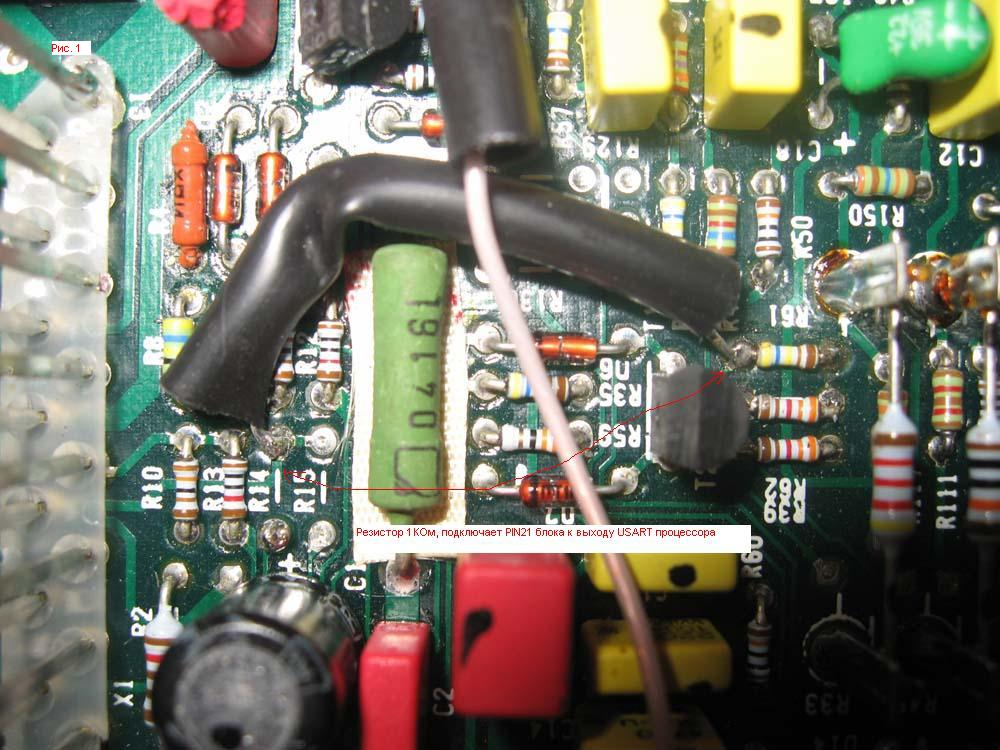

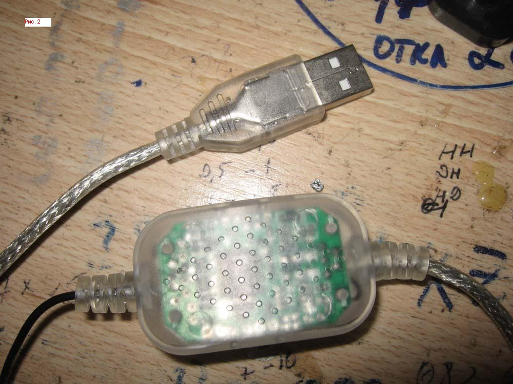

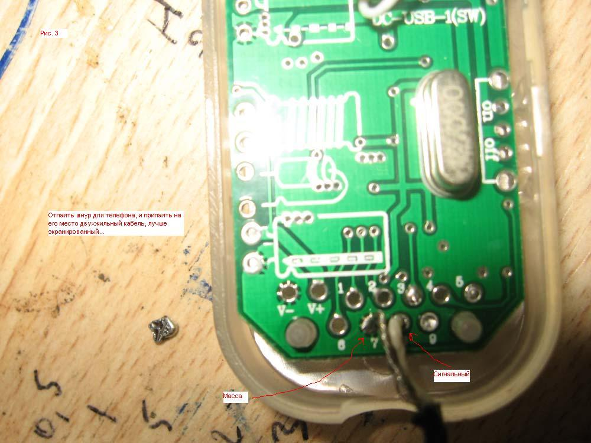

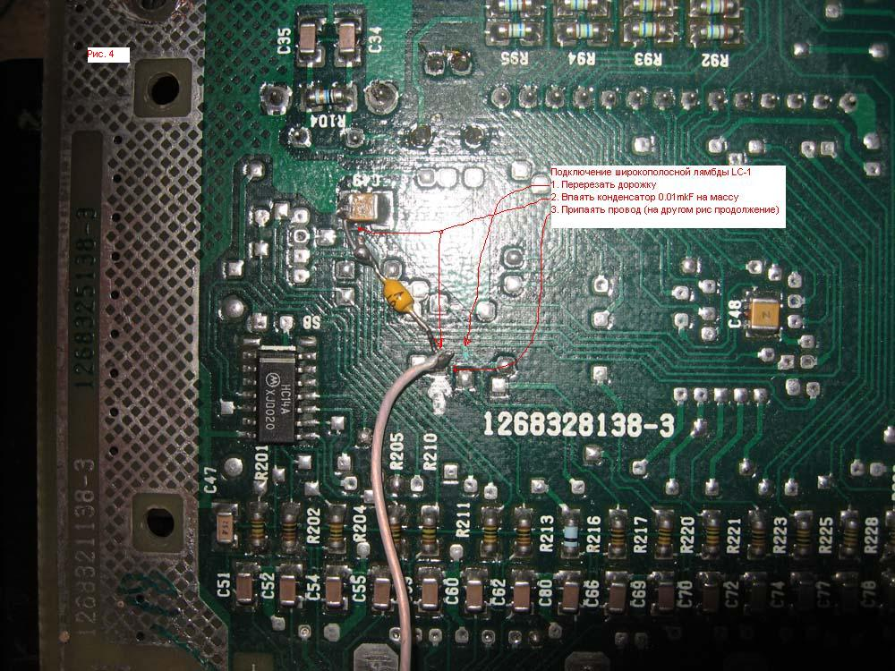

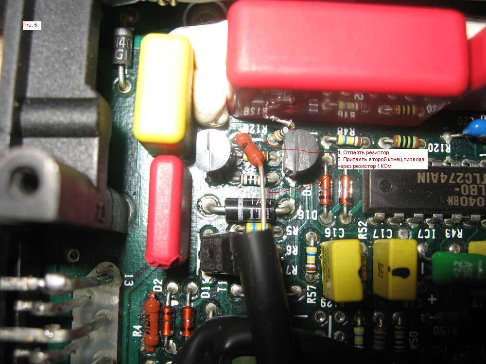

## Другие фотографии переделанного ЭБУ
###№1

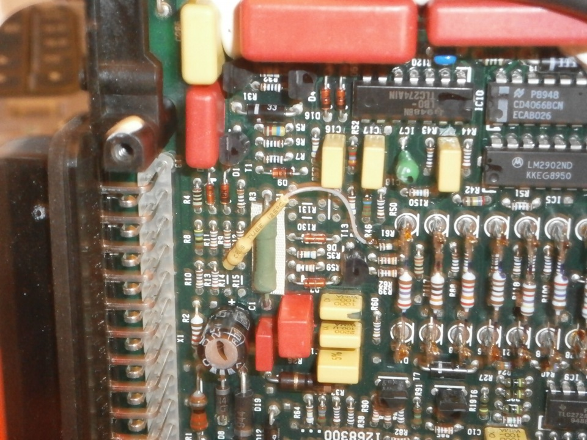

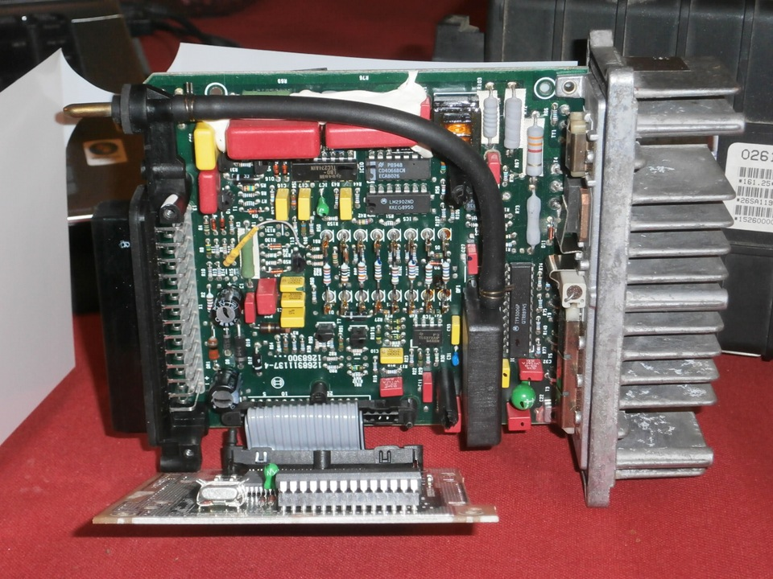

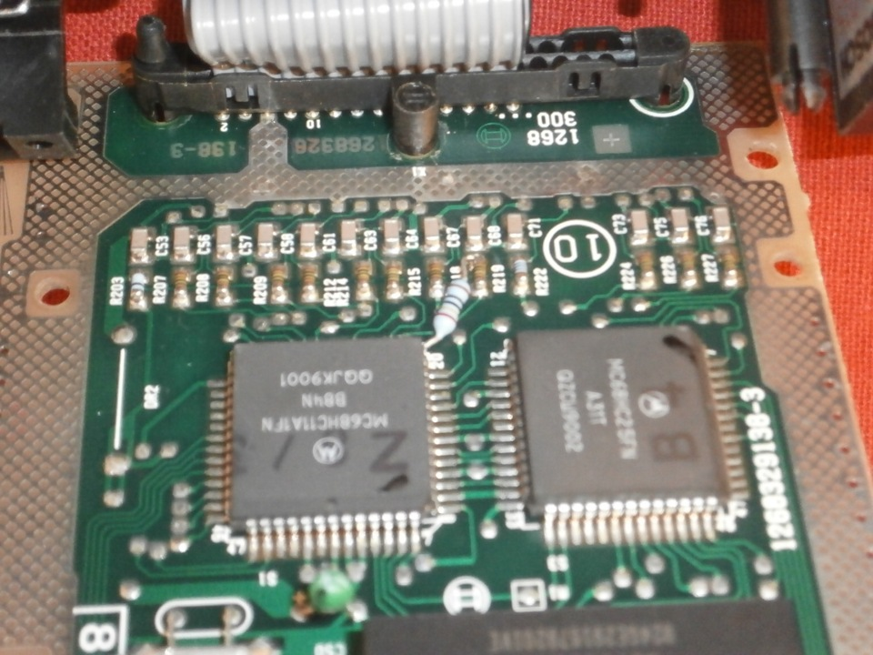

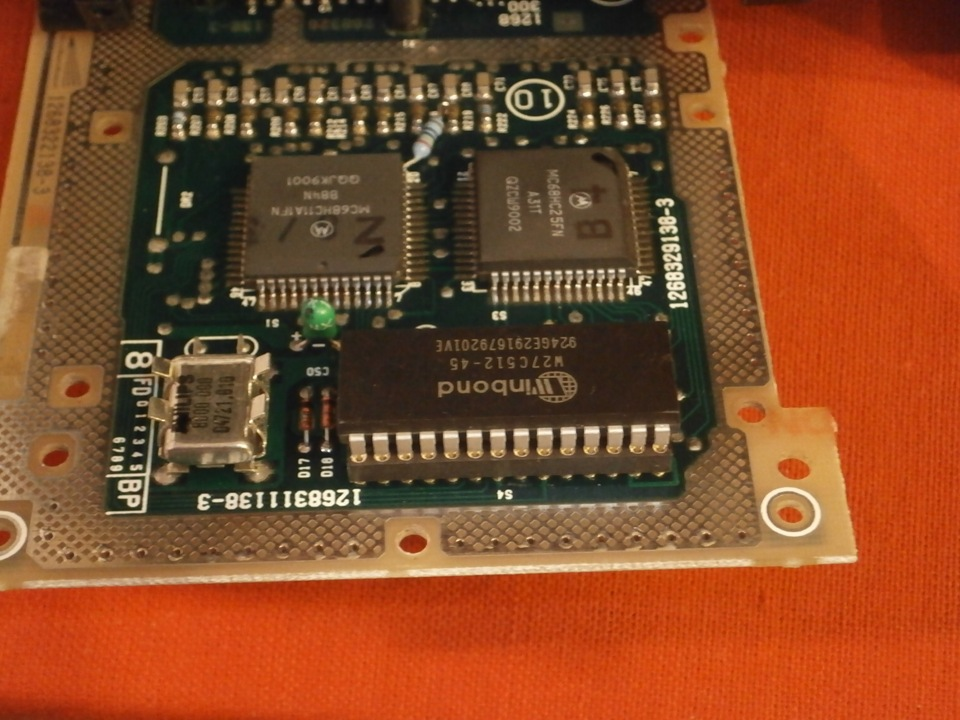

###№2

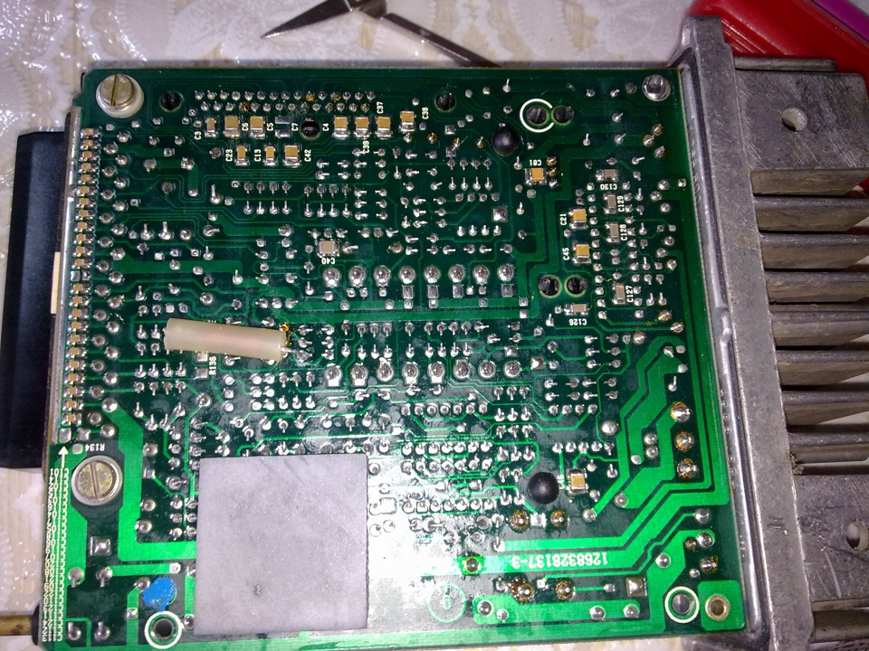

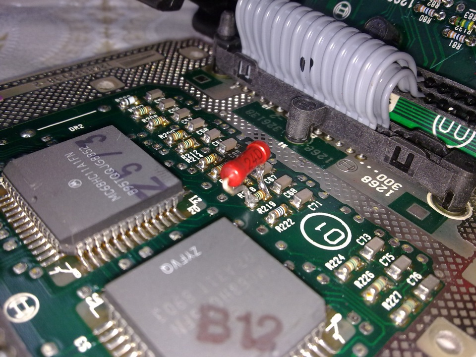